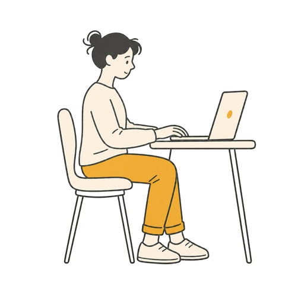
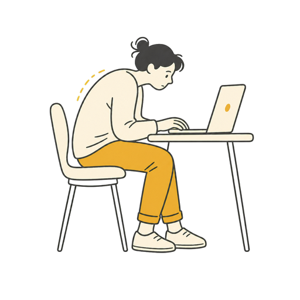

# Good Posture

Good Posture is a local-first Windows desktop app that helps you notice when
your seated posture may have drifted from your own comfortable baseline. It uses
your camera and on-device pose estimation to offer calm, optional movement
prompts—without uploading camera frames or requiring an account.

> Good Posture is a wellness-awareness tool, not a medical device. It does not
> diagnose, treat, prevent, or correct medical conditions.

<p align="center">
  
  
</p>

The illustrations above are the same assets used in the app's dashboard and
comfort prompt. They show the kind of gentle, non-diagnostic feedback Good
Posture is designed to provide.

## What it does

- Guides a short, camera-on calibration to establish a personal baseline.
- Monitors pose landmarks locally while you choose to run it.
- Uses confidence-aware scoring and time-aware smoothing to avoid reacting to
  brief motion, uncertain tracking, or a single frame.
- Offers a discreet companion prompt after a sustained deviation, with Quiet
  Mode and pause controls available from the system tray.
- Shows a compact local dashboard with day and week summaries.
- Supports explicit deletion of saved calibration and local history.

## How it works

```text
Camera → MediaPipe Pose Landmarker → derived posture metrics
       → personalized calibration + smoothing → sustained-deviation policy
       → tray controls, companion prompt, and local dashboard
```

The application separates the analysis engine from the Windows and Qt adapters:

- `src/goodposture/core/` contains calibration, posture metrics, scoring, and
  alert-policy logic.
- `src/goodposture/app/` composes those deterministic components into a session
  lifecycle.
- `src/goodposture/adapters/` handles local camera inference, SQLite storage,
  and diagnostics.
- `src/goodposture/ui/` provides the PySide6 desktop, calibration, tray, and
  companion-window experience.

The result is designed to be understandable and resilient in ordinary desktop
use: tracking uncertainty does not become a posture judgment, and prompts are
gated by sustained, confidence-qualified signals.

## Tech stack

- Python 3.12+
- PySide6 desktop UI and Windows system-tray integration
- MediaPipe Pose Landmarker for local pose estimation
- OpenCV camera capture
- SQLite for local settings, calibration, and aggregate summaries
- PyInstaller packaging scripts for Windows distribution

## Get started

Good Posture targets Windows. You will need Python 3.12 or 3.13 and a webcam.

```powershell
git clone https://github.com/nolanwu10/Good-Posture.git
cd Good-Posture
py -3.12 -m venv .venv
.\.venv\Scripts\Activate.ps1
python -m pip install --upgrade pip
python -m pip install -e .
```

Download the local pose model and verify its checksum:

```powershell
.\scripts\download_model.ps1
```

Start the desktop app:

```powershell
goodposture desktop
```

On first use, review the privacy notice, select a camera, and complete the
calibration flow. Monitoring starts only when you choose it; the tray menu lets
you pause, resume, enable Quiet Mode, open the dashboard, recalibrate, or exit.

For a camera-and-landmark viewer, run:

```powershell
goodposture prototype
```

## Privacy and data handling

- Camera frames and pose landmarks are processed in memory on the device.
- The app does not retain raw images, video, or landmark traces.
- It does not require a network service for real-time posture detection.
- Local SQLite storage contains only the calibration baseline, app settings,
  diagnostic event codes, and aggregate session/day summaries.
- You can remove saved calibration and local history from the app.

The pose-model download is an explicit setup step. After setup, normal
monitoring uses the local model and local camera only.

## Project layout

```text
src/goodposture/  Application package
tests/            Automated test suite
scripts/          Model-download and Windows packaging helpers
packaging/        Windows install and uninstall scripts
```

## Running tests

With the development dependencies installed, run:

```powershell
python -m pytest
```

## License

No license has been selected for this repository yet. Do not assume permission
to reuse or redistribute the code beyond what applicable law provides.
